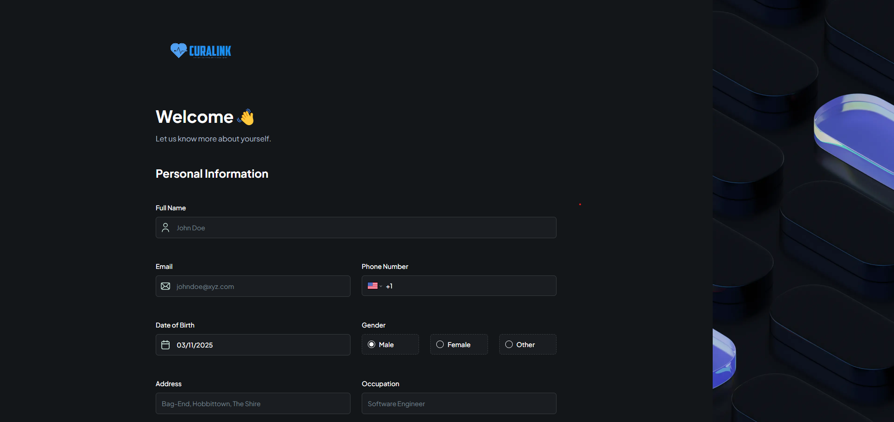
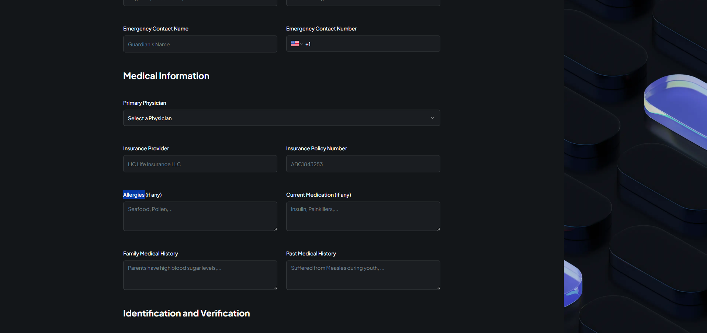
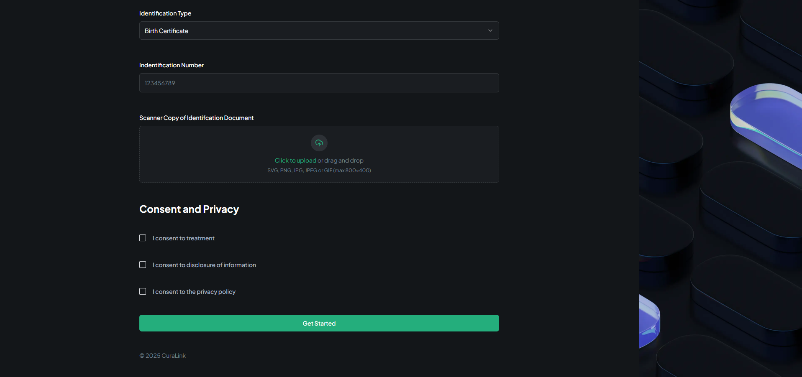
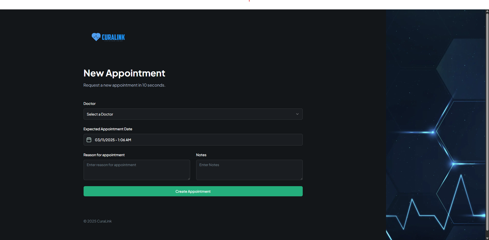
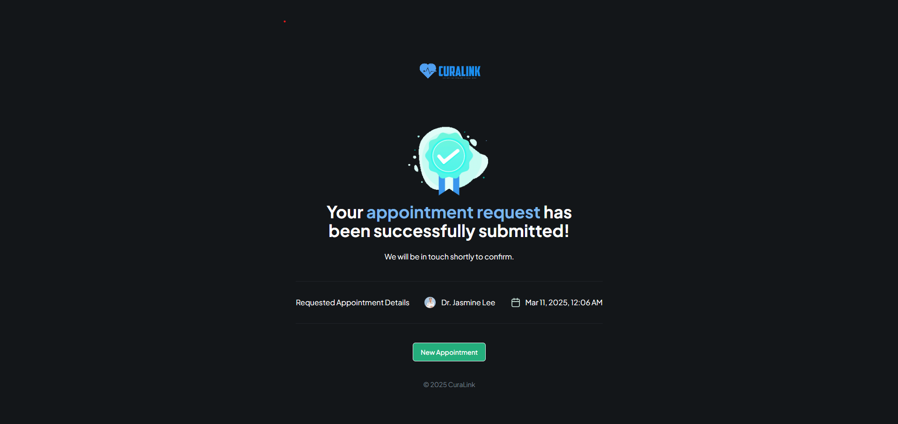
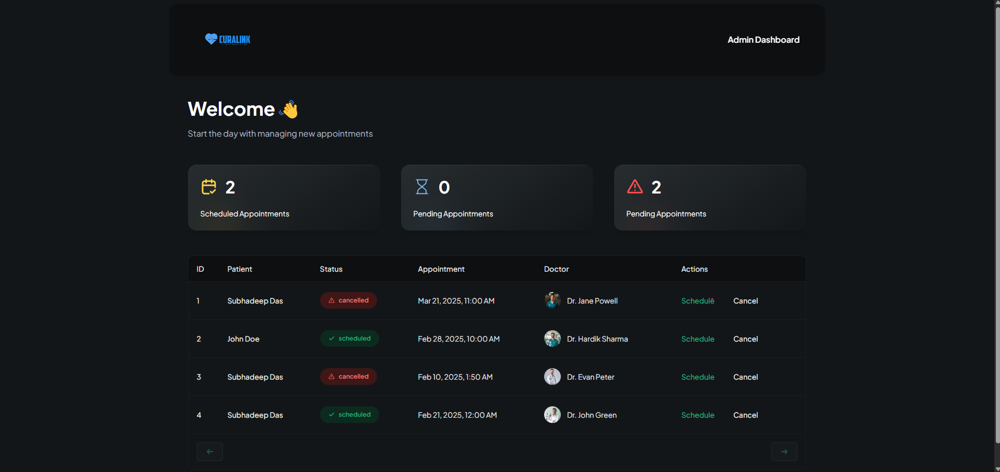

# Curalink-Patient Appointment Management System built using NEXT JS, Tailwind CSS, Shadcn, Twilio, and Appwrite cloud:-

Curalink is a patient management system where user(patients) can ask for an appointment with their preferred doctor by providing their past medical history and details of their current ailment. Once requested, an admin can then either schedule or cancel that particular appointment request, both of which the user will be notified via an SMS sent to their provided phone number during registration. The passkey to access the admin page is <b>123456</b>.

# What i learnt in this project:-
1) Improved understanding of web development using Next JS with Typescript and Tailwind.
2) Implementing Shadcn components.
3) Implementing Twilio for sending SMS notifications to the user.
4) Working with the realtime database provided by Appwrite Cloud. 


# Live version of the app:- [Link](https://patient-management-system-wheat.vercel.app/)

# Screenshots of the app:-
<p><b>Landing Page:-</b></p>

<p><b>Registration Page:-</b></p>



<p><b>Appointment Schedule Page:-</b></p>

<p><b>Appointment Confirmation Page:-</b></p>

<p><b>Admin Page:-</b></p>


# Next.js + Tailwind CSS Example

This example shows how to use [Tailwind CSS](https://tailwindcss.com/) [(v3.0)](https://tailwindcss.com/blog/tailwindcss-v3) with Next.js. It follows the steps outlined in the official [Tailwind docs](https://tailwindcss.com/docs/guides/nextjs).

## Preview

Preview the example live on [StackBlitz](http://stackblitz.com/):

[](https://stackblitz.com/github/vercel/next.js/tree/canary/examples/with-tailwindcss)

## Deploy your own

Deploy the example using [Vercel](https://vercel.com?utm_source=github&utm_medium=readme&utm_campaign=next-example):

[](https://vercel.com/new/git/external?repository-url=https://github.com/vercel/next.js/tree/canary/examples/with-tailwindcss&project-name=with-tailwindcss&repository-name=with-tailwindcss)

## How to use

Execute [`create-next-app`](https://github.com/vercel/next.js/tree/canary/packages/create-next-app) with [npm](https://docs.npmjs.com/cli/init) or [Yarn](https://yarnpkg.com/lang/en/docs/cli/create/) to bootstrap the example:

```bash
npx create-next-app --example with-tailwindcss with-tailwindcss-app
# or
yarn create next-app --example with-tailwindcss with-tailwindcss-app
```

Deploy it to the cloud with [Vercel](https://vercel.com/new?utm_source=github&utm_medium=readme&utm_campaign=next-example) ([Documentation](https://nextjs.org/docs/deployment)).